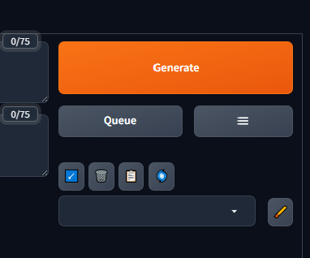

# Forge Simple Queue

A compact queue manager for Stable Diffusion WebUI Forge and Forge Neo.



Forge Simple Queue adds a `Queue` button next to the normal `Generate` button. Jobs can be queued from txt2img or img2img, then managed from a small modal without turning the main WebUI screen into a full scheduler.

## Features


- Queue txt2img and img2img jobs.
- View running, waiting, and pending jobs.
- Edit queued prompts before sampling starts.
- Pause, resume, delete, bulk delete, and reorder pending jobs.
- Stop or skip the active queued generation.
- Auto repeat selected jobs.
- Save, restore, or clear a saved queue.
- Keep recent history bounded.

## Installation

Clone this repository into your Forge extensions folder:

```bash
cd /path/to/sd-webui-forge/extensions
git clone https://github.com/Merueru/forge-simple-queue.git
```

Restart Forge or reload the WebUI after installation.

## Usage

1. Set up txt2img or img2img as usual.
2. Click `Queue` instead of `Generate`.
3. Continue editing settings and queue more jobs.
4. Open the queue modal with the small list button beside `Queue`.
5. Manage pending jobs from the modal.

The main button shows the queue state:

```text
Queue
Queue (3)
Queue (Running)
```

## Auto Repeat

Select one or more jobs with the checkbox, then enable `Auto repeat`. Forge Simple Queue keeps the selected jobs rotating without filling the queue with endless duplicates.

## Saved Queue

The saved queue controls can save the current queue, restore it later, or clear the saved snapshot. Saved queue data is local to the user's Forge installation and is not meant to be committed to the repository.

## Notes

- Pending jobs are stored in memory and are cleared when Forge restarts.
- Active jobs cannot be edited after sampling starts.
- Result restore depends on Forge's progress / restore-progress behavior.
- Compatibility can vary between Forge and Forge Neo builds because this extension uses internal WebUI APIs.

## Troubleshooting

If the queue button does not appear, reload the UI or restart Forge.

If progress or gallery restore looks stale, check the browser console and Forge terminal logs for messages prefixed with:

```text
[Forge Simple Queue]
```

## Development

Useful checks:

```bash
python -m py_compile scripts/forge_simple_queue.py
node --check javascript/forge_simple_queue.js
```

Syntax check without creating `__pycache__`:

```bash
python -c "import ast, pathlib; ast.parse(pathlib.Path('scripts/forge_simple_queue.py').read_text(encoding='utf-8')); print('python ast ok')"
```

## License

MIT
