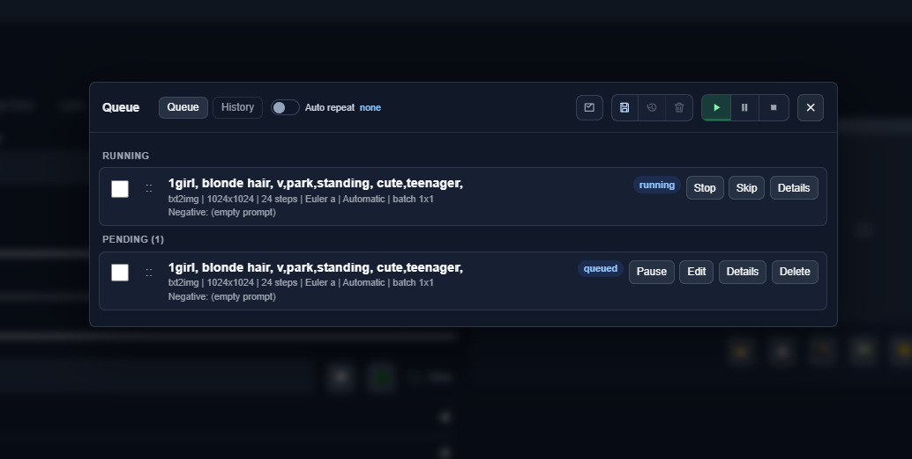
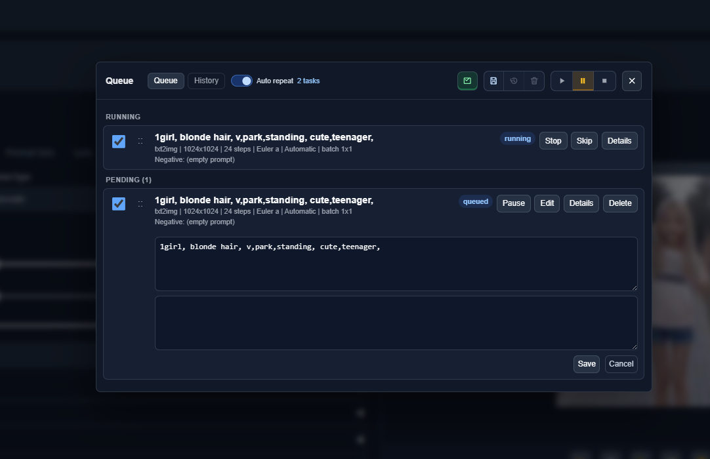
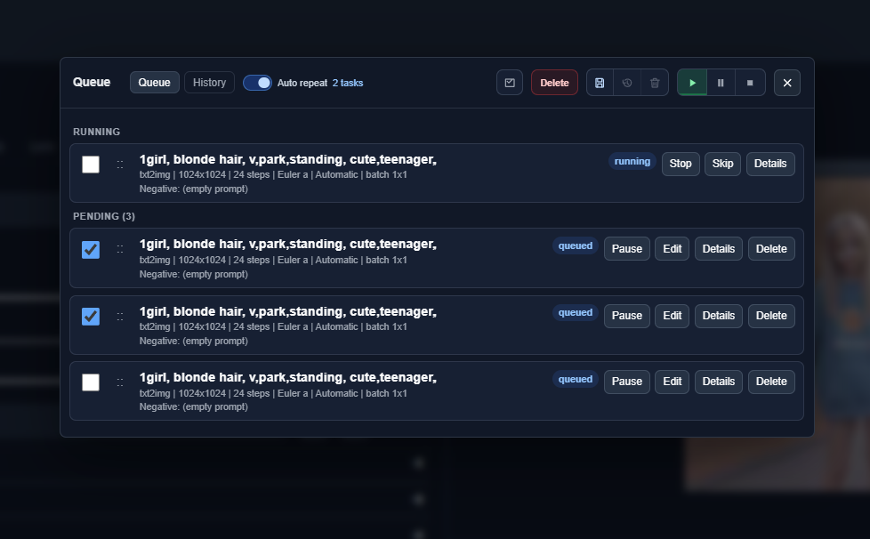
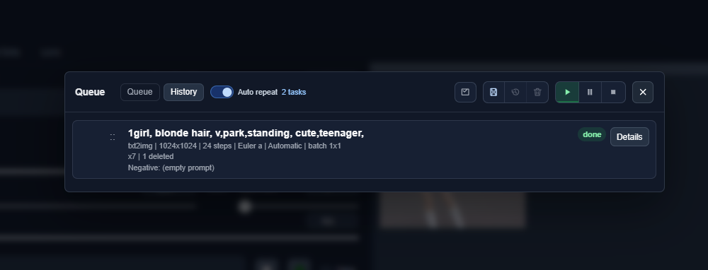
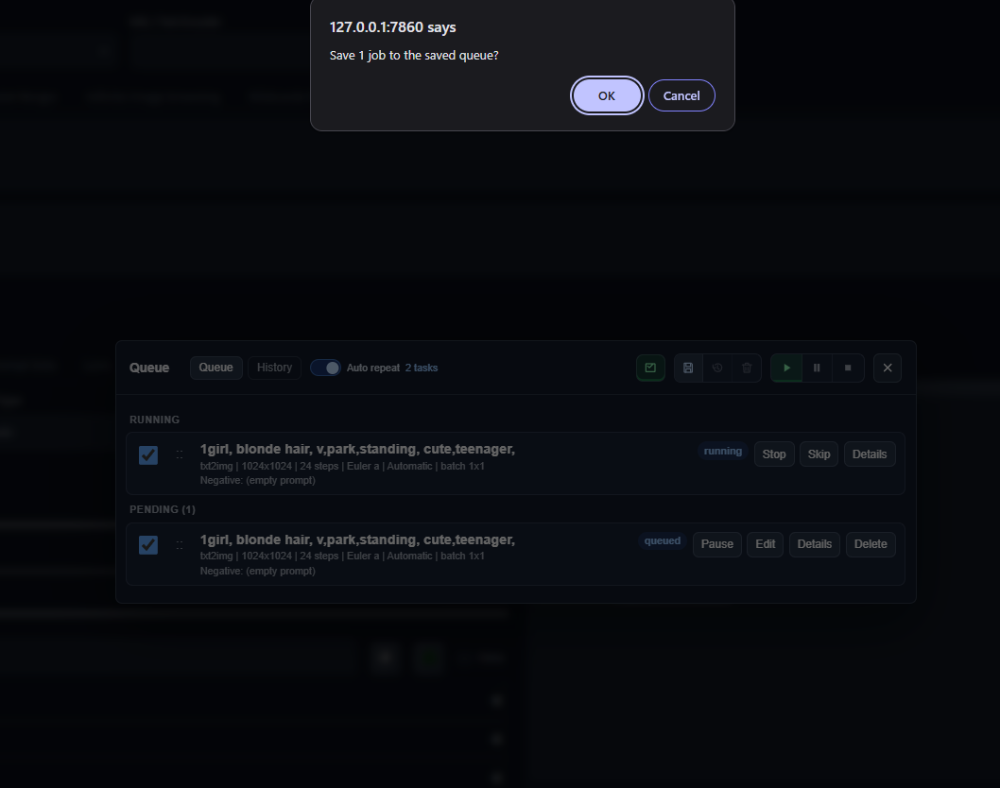

# Forge Simple Queue

A compact queue manager for Stable Diffusion WebUI Forge and Forge Neo.

Forge Simple Queue adds a `Queue` button beside the normal `Generate` button, so you can line up txt2img and img2img jobs while the current image is still running.

## Queue button


Click `Queue` to add the current txt2img or img2img settings as the next job. The button shows the current state, such as `Queue`, `Queue (3)`, or `Queue (Running)`.

## Queue modal



Open the queue modal to view running and pending jobs. Pending jobs can be paused, resumed, reordered, edited, deleted, or opened for details.

## Edit queued jobs



Queued prompts can be edited before they start. This is useful when you want to prepare several variations while another job is still generating.

## Auto repeat and bulk delete



Select jobs with the checkboxes to enable auto repeat or delete multiple pending jobs at once. Running jobs are kept protected from bulk delete.

## History



Finished jobs are shown in the History tab. History is kept bounded so long queue sessions do not keep growing forever.

## Saved queue



Use the saved queue controls to save the current queue, restore it later, or clear the saved snapshot. Saved queue data is local to your Forge installation.

## Features

- Queue txt2img and img2img jobs.
- View running, waiting, pending, and finished jobs.
- Edit queued prompts before sampling starts.
- Pause, resume, reorder, delete, and bulk delete pending jobs.
- Stop or skip the active queued generation.
- Auto repeat selected jobs.
- Save, restore, or clear a saved queue.
- Keep recent history bounded.

## Installation

Clone this repository into your Forge extensions folder:

```bash
cd /path/to/sd-webui-forge/extensions
git clone https://github.com/Merueru/forge-simple-queue.git
```

Restart Forge or reload the WebUI after installation.

## Notes

- Pending jobs are stored in memory and are cleared when Forge restarts.
- Active jobs cannot be edited after sampling starts.
- Result restore depends on Forge's progress / restore-progress behavior.
- Compatibility can vary between Forge and Forge Neo builds because this extension uses internal WebUI APIs.

## Development

Useful checks:

```bash
python -m py_compile scripts/forge_simple_queue.py
node --check javascript/forge_simple_queue.js
```

Syntax check without creating `__pycache__`:

```bash
python -c "import ast, pathlib; ast.parse(pathlib.Path('scripts/forge_simple_queue.py').read_text(encoding='utf-8')); print('python ast ok')"
```

## License

[MIT License](LICENSE)
